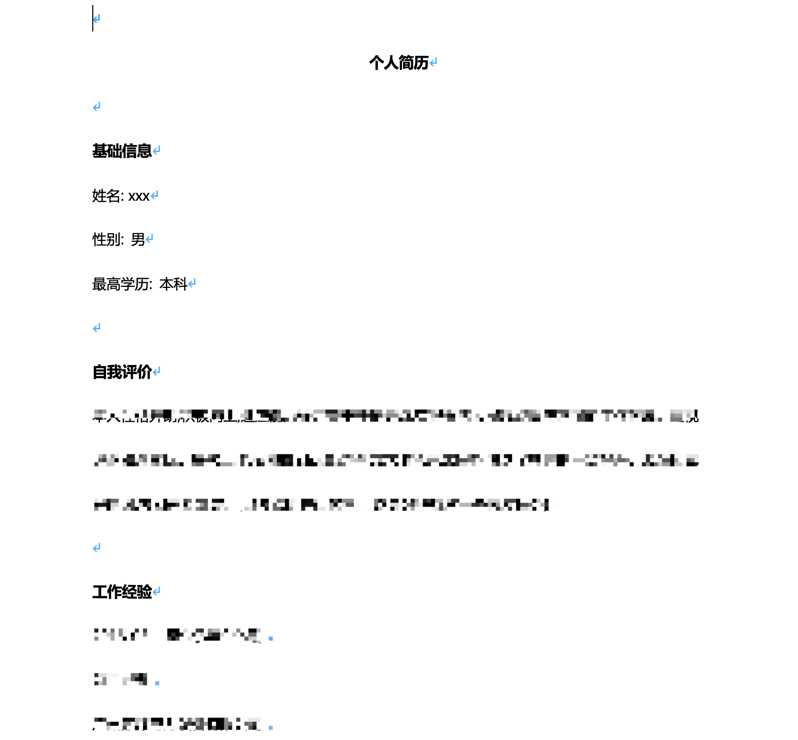
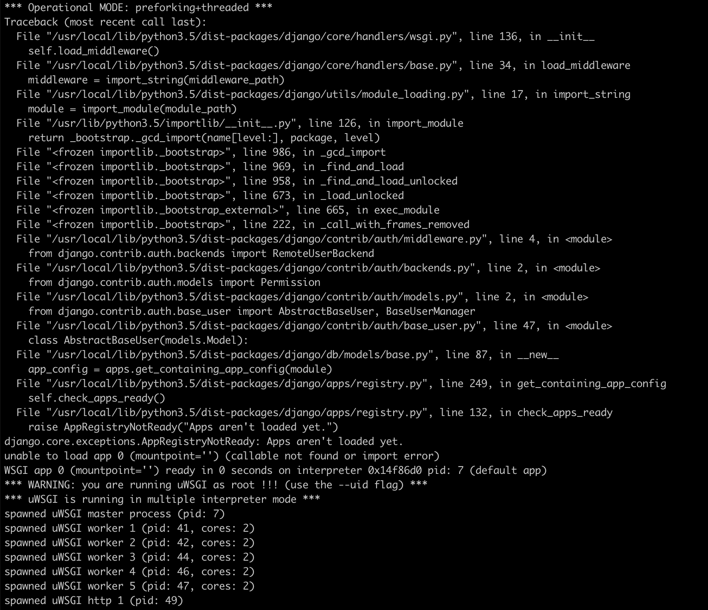

# TranscodePDF
主要解决部分文件需要进行转码 PDF 或者生成 Word 文件编写的简易程序。使用 Django 框架衔接 MySQL 数据库（校正文件 MD5 值来保证重复文件不再进行解析），此服务有个依赖程序为 [Upload Server](https://gitee.com/shileizcc_admin/Django-Upload-Files)，如果判定是重复文件（已经转码过的）会把已经解析好的文件 Url 地址返回给客户端。所以使用此服务时需要先把 Upload Server 启动。

# Upload Server
上传服务器只负责接收上传文件并放置预先设定好的目录结构，并把最终的 URL 地址返回给对方，使用 Nginx + Django 架构。Nginx 接收上传文件，Django 处理文件并把最终的响应体以 Json 数据返回给客户端。支持 form/curl/AppRequest 方式上传文件，并通过 Nginx Mirror 模块展示文件列表。

* 文件上传大小 10GB
* 最大一次请求长连接 5 分钟
* 支持跨域请求

文档地址：[Wiki](https://wiki.shileizcc.com/confluence/display/CASE/Django+Nginx+Upload)

## Start TranscodePDF
获取源码:
```
$ git clone -b database_model https://gitee.com/shileizcc_admin/TranscodePDF.git
```

详细的使用请先通过 Docker Compose 启动服务：
```
$ docker-compose up -d
```

## 功能介绍
* 转码 PDF 文件
* 生成 Word 文件

使用 PDF 功能时，只需要把相应的文件以 URL 或者 Base64 方式传入到接口后等待返回值即可，转码后的文件会存储到 Upload Server 中，返回值中会包含 Upload Server 中文件的具体 URL 如：

```
{
  "name": "c13f867a86d35f697434386985b97463_resume.html",
  "path": "/storage/firmware/resume/2018-07-25/c13f867a86d35f697434386985b97463_resume.html",
  "md5": "c13f867a86d35f697434386985b97463",
  "size": "22853",
  "ip": "218.240.137.69",
  "content_type": "multipart/form-data",
  "account_url": "http://172.17.145.245/firmware/resume/2018-07-25/c13f867a86d35f697434386985b97463_resume.html",
  "status": "success",
  "status_code": "200"
}
```

account_url 为最终的文件地址，通过 `Get` 方式获取即可。
详情请参照下方的文档以及 SDK 文件。

使用 Word 功能时，只需要把相应的数据发送到接口即可，接口会对数据事先进行整合然后写入到新的 Word 文件中。但事先需要传入一个 Word 模板文件（模板文件用于简历的布局，如果没有可传入一个空文件），否则会报错（必须传入），服务会把数据注入到模板文件内最终返回 Base64 文件内容。
生成的文件内容大体如下：


### Transcode in PDF
如果需要解析成 PDF，请参照 TranscodePDFClient.py 文件代码执行所需操作。
主要说明的是目前支持传递 html/txt/docx/doc 文件格式转码 PDF。
(由于自身服务的需要，此方法配合了 MySQl 作为存储，如果检测文件 MD5 值已经记录在内，则不进行解析，并返回解析后保存的地址，此服务后端存储需要配合 [Nginx Upload](https://gitee.com/shileizcc_admin/Django-Upload-Files/tree/nginx_upload/), 可传递 `mandatory_parsing` 参数强制解析.) 
PDF 支持两种方式，url 与 content，具体请参照示例。

### Transcode in Word
如果需要解析成 Word，请参照 TranscodeWordClient.py 文件代码执行所需操作。
主要说明，此服务属于自身业务所需而构建的，主要应用于原始数据导出 Word，所以需要两部分，一部分为 Data，一部分 Word Template，最后通过 Template 导出一份拼接好的文件内容。（Template 不支持空数据）
Template 支持两种方式，url 与 content(base64)，具体请参照示例。
数据会分成两部分，BaseInfo 数据前部分，另一部分有分隔符规定具体格式为：
```
项目经验$|_@内容体...
```

`项目经验`： 阶段标题。
`$|_@`：分隔符。
`内容体`：具体的内容。

### Docker-Compose 参数说明
```
version: '3'
services:
    transcode:
        image: slzcc/transcode:0.3.15
        container_name: transcode
        ports:
          - 8089:8089
        environment:
            MYSQL_DATABASE: resumec
            MYSQL_USER: resumec
            MYSQL_PASSWORD: resumec
            MYSQL_ROOT_USER: root
            MYSQL_ROOT_PASSWORD: example.org
            MYSQL_HOST: mysql
            MYSQL_PORT: 3306
            NGINX_MIRROR_ADDRESS: "http://47.95.219.151/"
            TZ: Asia/Shanghai
            NGF: "True"
            NGF_PROXY_ADDRESS_1: "218.240.137.68:8093"
            NGF_PROXY_ADDRESS_1: "cats.hydsoft.com:8093"
            NGF_TARGET_ADDRESS: "192.168.114.17:8080"
            ECHO_INPUT: "True"
...
```

`MYSQL_ROOT*`：历史遗留问题，可以不用管，主要为了解决准备数据库没有准备库，而通过脚本生成库的方案，但是没有更新目前还存在问题。

`NGINX_MIRROR_ADDRESS`：Upload Server 服务器的前端地址

`NGF`：是否使用内网地址转换，因为目前服务器存在一个问题，通过 NAT 方式转发端口暴露在单独的公网上，当服务自身访问这个公网时是被拒绝的，所以把需要通过公网访问的请求强制转换为内网，有三个子参数：
* `NGF_TARGET_ADDRESS`： 最终被转换的地址
* `NGF_PROXY_ADDRESS_1`：如果判定请求时此地址，则转换为 `NGF_TARGET_ADDRESS`
* `NGF_PROXY_ADDRESS_2`：如果判定请求时此地址，则转换为 `NGF_TARGET_ADDRESS`

`ECHO_INPUT`：主要用于测试，测试客户端发送过来需要写入 Word 数据打印出来，甄别是否有格式错误。

目前预正式环境使用的启动方式：
```
$ docker network create -d overlay cats
$ docker service create --detach --name cats-transcode --network cats --with-registry-auth --publish published=8089,target=8089,mode=host -e MYSQL_DATABASE=transcode_pdf -e MYSQL_USER=transcode_pdf -e MYSQL_PASSWORD=transcode_pdf -e MYSQL_ROOT_USER=root -e MYSQL_ROOT_PASSWORD=hydsoft.com -e MYSQL_HOST="192.168.114.170" -e MYSQL_PORT=3307 -e NGINX_MIRROR_ADDRESS="http://192.168.114.170:8876/" -e TZ=sia/Shanghai -e NGF="true" -e NGF_PROXY_ADDRESS_1="192.168.114.170" -e NGF_PROXY_ADDRESS_1="xxx.hydcloud.wan" -e NGF_TARGET_ADDRESS="xxx.hydcloud.wan:8091" -e ECHO_INPUT="True" slzcc/transcode:0.3.15
```
### 错误说明
如出现如下错误：

可忽略，主要测试功能无误即可，此问题是 uwsgi 启动时引发的一个内部错误。


[Wiki Docs Url](https://wiki.shileizcc.com/confluence/display/CASE/Django+TranscodePDF)
| Wiki 暂未更新

